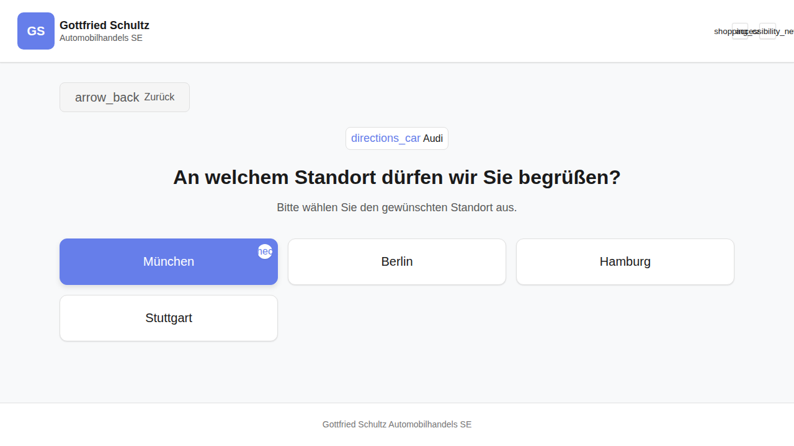

# REQ-002-Marke: Standortauswahl nach Marke

**Status:** Draft
**Priority:** High
**Type:** Functional
**Created:** 2026-06-20
**Author:** Claude Code
**Wizard-Schritt:** 2 von 8

---

## 1. Overview

### 1.1 Purpose
Nach der Markenauswahl auf dem Homescreen (REQ-002-Markenauswahl) navigiert der User zur Route `/marke/:slug`. Dort wird die Standortauswahl fuer Autohaus-Standorte der gewaehlten Marke angezeigt. Der User waehlt einen Standort, die Auswahl wird im Store gespeichert. Die Daten sind vollstaendig statisch -- kein Backend-Call erforderlich.

### 1.2 Scope
**Included:**
- Anzeige markenspezifischer Standorte als klickbare Cards in einem responsiven Grid
- Zurueck-Navigation zur Markenauswahl
- Speichern des gewaehlten Standorts (Autohaus) im MarkeStore
- Statische Autohaus-Daten pro Marke (5 Marken, 3-5 Standorte je Marke)
- Titel und Subtitle via i18n (DE + EN)

**Excluded:**
- Backend-API-Calls (alle Daten statisch)
- Markenauswahl selbst (REQ-002-Markenauswahl)
- Serviceauswahl (REQ-004)

### 1.3 Related Requirements
- REQ-002-Markenauswahl: Vorheriger Schritt, liefert `markeSlug` via Route-Parameter
- REQ-001-Header: Wiederverwendbarer Header mit Accessibility-Controls
- REQ-003-Standortwahl: Bestehende Standortwahl im Booking-Wizard (eigener Flow)

---

## 2. User Story

**Als** Kunde
**moechte ich** die Autohaus-Standorte meiner gewaehlten Fahrzeugmarke sehen und einen auswaehlen
**damit** ich weiss, welches Autohaus fuer meinen Service-Termin zustaendig ist.

**Acceptance Criteria:**
- [ ] AC-1: Benutzer sieht den Titel "An welchem Standort duerfen wir Sie begruessen?" (i18n)
- [ ] AC-2: Benutzer sieht den Subtitle "Bitte waehlen Sie den gewuenschten Standort aus." (i18n)
- [ ] AC-3: Benutzer sieht nur Standorte der gewaehlten Marke als Cards im Grid
- [ ] AC-4: Grid ist responsiv: 1 Spalte (Mobile), 2 Spalten (Tablet), 3 Spalten (Desktop)
- [ ] AC-5: Klick auf eine Standort-Card speichert das gewaehlte Autohaus im MarkeStore
- [ ] AC-6: Zurueck-Button navigiert zur Markenauswahl (Homescreen)
- [ ] AC-7: Keyboard-Navigation mit Tab + Enter/Space funktioniert auf allen Cards
- [ ] AC-8: Bei ungueltigem `:slug` in der URL wird zur Markenauswahl redirected
- [ ] AC-9: Wenn keine Standorte fuer die Marke existieren, wird ein Hinweistext angezeigt
- [ ] AC-10: Alle UI-Texte sind in DE und EN verfuegbar (i18n)

---

## 3. Preconditions

### 3.1 System
- Angular App laeuft
- Routing konfiguriert mit Lazy Loading
- Header-Component verfuegbar (REQ-001)
- MarkeStore verfuegbar

### 3.2 User
- Keine Authentifizierung erforderlich
- Benutzer hat auf dem Homescreen eine Marke gewaehlt (REQ-002-Markenauswahl)

### 3.3 Data
- Marke muss als gueltig erkannt werden (einer der 5 Slugs: `audi`, `bmw`, `mercedes-benz`, `mini`, `volkswagen`)
- Autohaus-Daten sind statisch in `autohaeuser.data.ts` hinterlegt
- Kein Backend erforderlich (Click-Dummy)

### 3.4 Uebergabe (Input von REQ-002-Markenauswahl)
| Feld | Typ | Quelle | Pflicht |
|------|-----|--------|---------|
| `:slug` (Route-Parameter) | `string` | URL `/marke/:slug` | **Ja** -- Guard prueft, Redirect zu Markenauswahl wenn ungueltig |

---

## 4. Main Flow



**Step 1:** Seite wird geladen
- **System:** Liest `:slug` aus der Route
- **System:** Resolver laedt statische Autohaus-Daten gefiltert nach `markeSlug`
- **System:** Zeigt Zurueck-Button, Titel und Subtitle
- **System:** Rendert Standort-Cards im responsiven Grid

**Step 2:** Benutzer waehlt einen Standort
- **User:** Klickt auf eine Standort-Card
- **System:** Ruft `onLocationSelect(autohaus)` im Container auf
- **System:** Speichert `ausgewaehltesAutohaus` im MarkeStore via `selectDealership(autohaus)`
- **Expected:** Autohaus ist im Store gespeichert

**Step 3:** Benutzer navigiert zurueck
- **User:** Klickt auf Zurueck-Button
- **System:** Ruft `onBackToHome()` im Container auf
- **System:** Navigiert zu Markenauswahl (Homescreen)

---

## 5. Alternative Flows

### 5.1 Keyboard-Navigation

**Trigger:** Benutzer navigiert mit Tastatur

**Flow:**
1. Benutzer drueckt Tab, um durch Zurueck-Button und Standort-Cards zu navigieren
2. Fokussierte Card erhaelt visuellen Focus-Ring (`--color-focus-ring`)
3. Benutzer drueckt Enter oder Space auf fokussierter Card
4. System behandelt dies wie einen Klick (Step 2 aus Main Flow)

### 5.2 Zurueck-Navigation

**Trigger:** Benutzer klickt Zurueck-Button oder Browser-Zurueck

**Flow:**
1. System navigiert zur Markenauswahl (Homescreen)
2. Gewaehlter Standort bleibt im Store (falls bereits gewaehlt)

---

## 6. Exception Flows

### 6.1 Ungueltiger Slug in der URL

**Trigger:** Direktaufruf von `/marke/invalid-slug` mit nicht existierendem Slug

**Flow:**
1. Guard prueft `:slug` gegen die Liste der gueltigen Marken-Slugs
2. Slug ist ungueltig (nicht in `['audi', 'bmw', 'mercedes-benz', 'mini', 'volkswagen']`)
3. Guard leitet um zur Markenauswahl (Homescreen)
4. Kein Fehler wird dem User angezeigt

### 6.2 Keine Standorte fuer Marke verfuegbar

**Trigger:** Marke hat keine zugeordneten Autohaus-Standorte (theoretischer Edge Case)

**Flow:**
1. Resolver laedt Daten, findet keine Standorte fuer den Slug
2. System zeigt Hinweistext: "Keine Standorte verfuegbar." (i18n Key `marke.keinStandort`)
3. Zurueck-Button bleibt verfuegbar

---

## 7. Postconditions

### 7.1 Success
| Feld | Typ | Wert | Beschreibung |
|------|-----|------|--------------|
| `MarkeStore.brandSlug` | `string` | z.B. `'audi'` | Slug der gewaehlten Marke |
| `MarkeStore.selectedDealership` | `Autohaus` | z.B. `{ id: 'audi-muc', name: 'Audi Muenchen', stadt: 'Muenchen', markeSlug: 'audi', slug: 'audi-muenchen' }` | **Neu gewaehlt** |

### 7.2 Failure
- Keine Aenderungen am Store (Benutzer hat nichts gewaehlt)
- Bei ungueltigem Slug: Redirect, kein Store-Update

---

## 8. Business Rules

- **BR-1:** Statische Zuordnung Marke zu Standorten:
  | Marke | Standorte |
  |-------|-----------|
  | Audi | Muenchen, Berlin, Hamburg, Stuttgart |
  | BMW | Muenchen, Frankfurt, Duesseldorf, Hamburg |
  | Mercedes-Benz | Stuttgart, Muenchen, Berlin, Koeln |
  | MINI | Muenchen, Berlin, Hamburg |
  | Volkswagen | Hannover, Wolfsburg, Berlin, Muenchen |

- **BR-2:** Nur ein Standort waehlbar (kein Multi-Select)
- **BR-3:** Alle Daten statisch -- kein API-Call, kein Backend
- **BR-4:** Gueltige Marken-Slugs: `audi`, `bmw`, `mercedes-benz`, `mini`, `volkswagen`
- **BR-5:** Jedes Autohaus hat eine eindeutige `id` im Format `{markeSlug}-{stadtSlug}`

---

## 9. Non-Functional Requirements

### Performance
- Seitenaufbau < 300ms (statische Daten, kein API-Call)
- Lazy Loading der MarkeContainerComponent

### Usability
- Mobile-First: Cards stacken vertikal auf Mobile (1 Spalte)
- Touch-friendly: Min `--touch-target-min` (2.75em / 44px) Card-Hoehe
- WCAG 2.1 AA: Keyboard-Navigation mit Tab + Enter/Space
- Focus-Ring auf fokussierten Cards (`--color-focus-ring`)

### Accessibility
- Alle interaktiven Elemente mit `role="button"` oder `<button>` Element
- `aria-label` auf dem Zurueck-Button
- `aria-label` auf dem Cards-Grid-Container
- Reduced Motion: Keine Animationen wenn `prefers-reduced-motion: reduce`

---

## 10. Data Model

```typescript
/**
 * Autohaus (dealership) model
 * Represents a single car dealership location
 */
interface Autohaus {
  id: string;          // Unique ID, e.g. 'audi-muenchen'
  name: string;        // Display name, e.g. 'Audi Muenchen'
  stadt: string;       // City name, e.g. 'Muenchen'
  markeSlug: string;   // Brand slug, e.g. 'audi'
  slug: string;        // URL slug, e.g. 'audi-muenchen'
}

/**
 * Store state for the Marke feature
 * Tracks brand, dealerships, and selected dealership
 */
interface MarkeZustand {
  markeSlug: string | null;
  autohaeuser: Autohaus[];
  ausgewaehltesAutohaus: Autohaus | null;
  ladend: boolean;
}
```

**Statische Autohaus-Daten:**

| id | name | stadt | markeSlug | slug |
|----|------|-------|-----------|------|
| `audi-muenchen` | Audi Muenchen | Muenchen | `audi` | `audi-muenchen` |
| `audi-berlin` | Audi Berlin | Berlin | `audi` | `audi-berlin` |
| `audi-hamburg` | Audi Hamburg | Hamburg | `audi` | `audi-hamburg` |
| `audi-stuttgart` | Audi Stuttgart | Stuttgart | `audi` | `audi-stuttgart` |
| `bmw-muenchen` | BMW Muenchen | Muenchen | `bmw` | `bmw-muenchen` |
| `bmw-frankfurt` | BMW Frankfurt | Frankfurt | `bmw` | `bmw-frankfurt` |
| `bmw-duesseldorf` | BMW Duesseldorf | Duesseldorf | `bmw` | `bmw-duesseldorf` |
| `bmw-hamburg` | BMW Hamburg | Hamburg | `bmw` | `bmw-hamburg` |
| `mercedes-stuttgart` | Mercedes-Benz Stuttgart | Stuttgart | `mercedes-benz` | `mercedes-stuttgart` |
| `mercedes-muenchen` | Mercedes-Benz Muenchen | Muenchen | `mercedes-benz` | `mercedes-muenchen` |
| `mercedes-berlin` | Mercedes-Benz Berlin | Berlin | `mercedes-benz` | `mercedes-berlin` |
| `mercedes-koeln` | Mercedes-Benz Koeln | Koeln | `mercedes-benz` | `mercedes-koeln` |
| `mini-muenchen` | MINI Muenchen | Muenchen | `mini` | `mini-muenchen` |
| `mini-berlin` | MINI Berlin | Berlin | `mini` | `mini-berlin` |
| `mini-hamburg` | MINI Hamburg | Hamburg | `mini` | `mini-hamburg` |
| `vw-hannover` | Volkswagen Hannover | Hannover | `volkswagen` | `vw-hannover` |
| `vw-wolfsburg` | Volkswagen Wolfsburg | Wolfsburg | `volkswagen` | `vw-wolfsburg` |
| `vw-berlin` | Volkswagen Berlin | Berlin | `volkswagen` | `vw-berlin` |
| `vw-muenchen` | Volkswagen Muenchen | Muenchen | `volkswagen` | `vw-muenchen` |

---

## 11. UI/UX

### Mockup


### UI-Elemente

| Element | Typ | Material Component | Beschreibung |
|---------|-----|--------------------|--------------|
| Zurueck-Button | Button | `mat-button` | Navigiert zur Markenauswahl, Text: `marke.zurueck` |
| Titel | Heading | `<h1>` | "An welchem Standort duerfen wir Sie begruessen?" (`marke.titel`) |
| Subtitle | Paragraph | `<p>` | "Bitte waehlen Sie den gewuenschten Standort aus." (`marke.beschreibung`) |
| Standort-Grid | Layout | CSS Grid | Responsives Grid fuer Standort-Cards |
| Standort-Card | Card | `mat-card` | Klickbare Card mit Standort-Name und Stadt |
| Hinweistext | Paragraph | `<p>` | "Keine Standorte verfuegbar." (`marke.keinStandort`) -- nur wenn leer |

### Responsive Breakpoints

| Breakpoint | Spalten | Beschreibung |
|------------|---------|--------------|
| < 600px (Mobile) | 1 | Cards nehmen volle Breite ein |
| 600px - 959px (Tablet) | 2 | Zwei Cards nebeneinander |
| >= 960px (Desktop) | 3 | Drei Cards nebeneinander |

### Design-Hinweis
- Helles Theme aus `_variables.scss` verwenden
- Background: `--color-background-page`
- Cards: `--color-background-surface` mit `--shadow-medium`
- Card Hover: `--color-background-hover`
- Text: `--color-text-primary` (Titel), `--color-text-secondary` (Subtitle)
- Focus-Ring: `--color-focus-ring`
- Spacing: `--spacing-md` (Grid Gap), `--spacing-lg` (Section Padding)
- Border-Radius: `--radius-lg` (Cards)

---

## 12. API Specification

Kein API-Call erforderlich. Alle Daten sind statisch.

```typescript
// Static data in autohaeuser.data.ts
// No HTTP calls, no backend dependency

import type { Autohaus } from '../models/autohaus.model';

export const ALLE_AUTOHAEUSER: Autohaus[] = [
  // Audi
  { id: 'audi-muenchen', name: 'Audi Muenchen', stadt: 'Muenchen', markeSlug: 'audi', slug: 'audi-muenchen' },
  { id: 'audi-berlin', name: 'Audi Berlin', stadt: 'Berlin', markeSlug: 'audi', slug: 'audi-berlin' },
  // ... weitere Eintraege
];

/**
 * Filters dealerships by brand slug
 * Returns empty array if slug is unknown
 */
export function getDealershipsByBrand(slug: string): Autohaus[] {
  return ALLE_AUTOHAEUSER.filter(a => a.markeSlug === slug);
}
```

> Click-Dummy: Statische Daten, kein echtes Backend.

---

## 13. Test Cases

### TC-1: Happy Path -- Standorte fuer Audi laden
- **Given:** Benutzer navigiert zu `/marke/audi`
- **When:** Seite wird geladen
- **Then:** 4 Standort-Cards werden angezeigt (Muenchen, Berlin, Hamburg, Stuttgart)

### TC-2: Standort auswaehlen
- **Given:** Standort-Cards fuer Audi werden angezeigt
- **When:** Benutzer klickt auf "Audi Muenchen"
- **Then:** `MarkeStore.selectedDealership` ist gesetzt mit `id: 'audi-muenchen'`

### TC-3: Keyboard-Navigation
- **Given:** Benutzer ist auf der Standortauswahl-Seite
- **When:** Tab zu "BMW Frankfurt", Enter druecken
- **Then:** Autohaus "BMW Frankfurt" wird im Store gespeichert

### TC-4: Zurueck-Navigation
- **Given:** Benutzer ist auf `/marke/bmw`
- **When:** Klick auf Zurueck-Button
- **Then:** Navigation zur Markenauswahl (Homescreen)

### TC-5: Ungueltiger Slug -- Redirect
- **Given:** Kein gueltiger Marken-Slug
- **When:** Direktaufruf `/marke/invalid`
- **Then:** Redirect zur Markenauswahl (Homescreen)

### TC-6: MINI hat 3 Standorte
- **Given:** Benutzer navigiert zu `/marke/mini`
- **When:** Seite wird geladen
- **Then:** Genau 3 Standort-Cards werden angezeigt (Muenchen, Berlin, Hamburg)

### TC-7: Keine Standorte -- Hinweistext
- **Given:** Eine Marke ohne zugeordnete Standorte (Edge Case)
- **When:** Seite wird geladen
- **Then:** Hinweistext "Keine Standorte verfuegbar." wird angezeigt

### TC-8: Responsives Grid -- Mobile
- **Given:** Viewport-Breite < 600px
- **When:** Seite wird geladen
- **Then:** Cards werden in 1 Spalte dargestellt

### TC-9: Responsives Grid -- Desktop
- **Given:** Viewport-Breite >= 960px
- **When:** Seite wird geladen
- **Then:** Cards werden in 3 Spalten dargestellt

---

## 14. Implementation

### Components
- [ ] `MarkeContainerComponent` -- Container, `inject(MarkeStore)`, Event Handler
- [ ] `StandortauswahlComponent` -- Presentational, `input(locations)`, `input(brandName)`, `output(locationSelected)`

### Stores
- [ ] `MarkeStore` -- SignalStore mit `brandSlug`, `dealerships`, `selectedDealership`, `loading`

### Data
- [ ] `autohaeuser.data.ts` -- Statische Autohaus-Daten + Filter-Funktion

### Models
- [ ] `autohaus.model.ts` -- `Autohaus` Interface, `MarkeZustand` Interface

### Guard
- [ ] `markeSlugGuard` -- Prueft `:slug` gegen gueltige Marken-Slugs, Redirect bei ungueltig

### Resolver
- [ ] `markeResolver` -- Liest `:slug`, laedt Autohaus-Daten via `MarkeStore.loadDealershipsForBrand(slug)`

### Route
```typescript
// marke.routes.ts
{
  path: ':slug',
  component: MarkeContainerComponent,
  resolve: { _: markeResolver },
  canActivate: [markeSlugGuard]
}
```

### File Structure
```
src/app/features/marke/
├── containers/
│   └── marke-container/
│       ├── marke-container.component.ts     (Container)
│       ├── marke-container.component.html
│       └── marke-container.component.scss
├── components/
│   └── standortauswahl/
│       ├── standortauswahl.component.ts     (Presentational)
│       ├── standortauswahl.component.html
│       └── standortauswahl.component.scss
├── data/
│   └── autohaeuser.data.ts                  (Static dealership data)
├── stores/
│   └── marke.store.ts                       (SignalStore)
├── models/
│   └── autohaus.model.ts                    (Interfaces)
├── resolvers/
│   └── marke.resolver.ts                    (Resolver)
├── guards/
│   └── marke-slug.guard.ts                  (Guard)
└── marke.routes.ts                          (Lazy-loaded routes)
```

---

## 15. Dependencies

**Requires:**
- REQ-001-Header: Wiederverwendbarer Header mit Accessibility-Controls
- REQ-002-Markenauswahl: Liefert `markeSlug` via Navigation zu `/marke/:slug`

**Blocks:**
- Zukuenftige Features die auf dem gewaehlten Autohaus aufbauen

---

## 16. Naming Glossary

### Container Methods (ENGLISCH)
| Method | Description |
|--------|-------------|
| `onLocationSelect(autohaus: Autohaus)` | Location selection handler -- saves to store |
| `onBackToHome()` | Navigates back to brand selection (homescreen) |

### Presentational Inputs/Outputs (ENGLISCH)
| Member | Type | Description |
|--------|------|-------------|
| `locations: input<Autohaus[]>()` | Input | List of dealerships for the selected brand |
| `brandName: input<string>()` | Input | Display name of the selected brand |
| `locationSelected: output<Autohaus>()` | Output | Emits when a dealership card is clicked |

### Signal Store (ENGLISCH)
| Member | Type | Description |
|--------|------|-------------|
| **State** | | |
| `brandSlug` | `string \| null` | Brand slug from route parameter |
| `dealerships` | `Autohaus[]` | Filtered dealership list |
| `selectedDealership` | `Autohaus \| null` | Currently selected dealership |
| `loading` | `boolean` | Loading state |
| **Computed** | | |
| `hasDealerships` | `Signal<boolean>` | `true` if dealerships list is not empty |
| `dealershipCount` | `Signal<number>` | Number of available dealerships |
| **Methods** | | |
| `loadDealershipsForBrand(slug: string)` | `void` | Loads static dealership data filtered by brand slug |
| `selectDealership(autohaus: Autohaus)` | `void` | Sets the selected dealership in state |

### i18n Keys (DE + EN)

```typescript
// DE
'marke.titel': 'An welchem Standort duerfen wir Sie begruessen?'
'marke.beschreibung': 'Bitte waehlen Sie den gewuenschten Standort aus.'
'marke.zurueck': 'Zurueck zur Markenauswahl'
'marke.keinStandort': 'Keine Standorte verfuegbar.'

// EN
'marke.titel': 'At which location may we welcome you?'
'marke.beschreibung': 'Please select your preferred location.'
'marke.zurueck': 'Back to brand selection'
'marke.keinStandort': 'No locations available.'
```

### CSS-Klassen (ENGLISCH)
| Class | Element |
|-------|---------|
| `.location-selection-page` | Page wrapper |
| `.location-selection-header` | Back button + title area |
| `.location-selection-grid` | CSS Grid container for cards |
| `.location-card` | Individual dealership card |
| `.location-card--focused` | Focused card state |
| `.location-card__name` | Dealership name text |
| `.location-card__city` | City name text |
| `.empty-state` | No locations message |

---

## 17. Approval

| Role | Name | Date |
|------|------|------|
| Product Owner | | |
| Tech Lead | | |

---

## 18. Implementation Notes

**WICHTIG: Code muss BILINGUAL sein!**

Siehe `.claude/skills/bilingual-code.md` fuer Details:
- Code-Sprache (Variablen, Methoden, Klassen, CSS-Klassen): ENGLISCH
- UI-Sprache: DE + EN via i18n Keys
- Kommentare DE + EN
- Error Messages Englisch
- JSDoc bilingual

**Farben NUR als CSS-Variable referenzieren:**
- `var(--color-background-page)` statt `#f8f9fa`
- `var(--color-text-primary)` statt `#1a1a1a`
- Keine Hex-Werte im SCSS!

**Container/Presentational Pattern strikt einhalten:**
- Container: `inject(MarkeStore)`, `inject(Router)`, Event Handler
- Presentational: Nur `input()` / `output()`, kein Store-Inject
- OnPush ChangeDetection ueberall
- Separate HTML + SCSS Files
